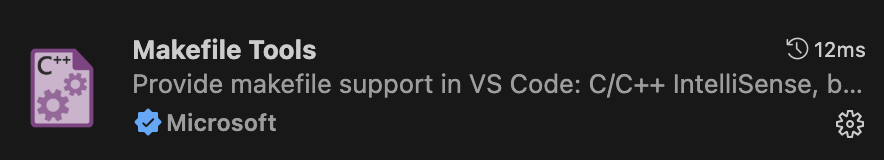

# ThisIsDataEngineer
- DataEngineering Study
- 각 컴포넌트 별로 디렉토리를 구성하고 학습한 과정을 commit 한다.


## VSCode Extentions
vscode-icons 설치하기(EXPLORER 의 디렉토리, 파일 아이콘 적용)


Makefile Tools 설치하기




## Makefile 사용 가이드
```bash
# brew 를 이용해서 make 설치하기
$ brew install make

# pyenv 설치하는 make goal 실행
$ make install.pyenv -f ./Makefile
```