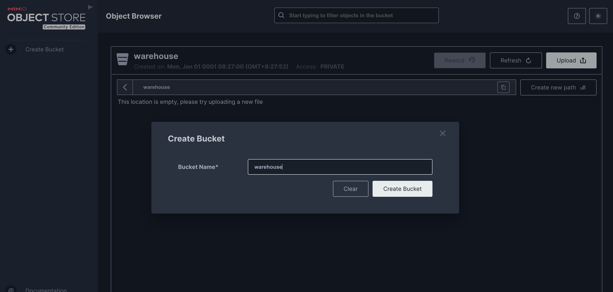
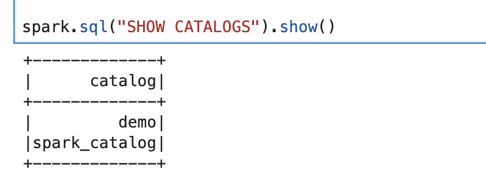

## How to start iceberg with mino
README.md 내용을 참고하여 청므 환경 구성 했을 경우 아래와 같이 minio 에서 bucket 을 생성하고 PySpark 에서 CREATE Catalog 명령어를 실행하고 Iceberg 공부를 시작하면 된다.

### MinIO bucket 생성




### Spark session config 설정

```python
from pyspark.sql import SparkSession

spark = SparkSession.builder \
        .appName("IcebergSparkWithMinIo") \
        .config("spark.sql.catalog.iceberg_catalog", "org.apache.iceberg.spark.SparkCatalog") \
        .config("spark.sql.catalog.iceberg_catalog.type", "rest") \
        .config("spark.sql.catalog.iceberg_catalog.uri", "http://iceberg-rest:8181") \
        .config("spark.sql.catalog.iceberg_catalog.warehouse", "s3://warehouse/") \
        .config("spark.sql.catalog.iceberg_catalog.io-impl", "org.apache.iceberg.aws.s3.S3FileIO") \
        .config("spark.sql.catalog.iceberg_catalog.s3.endpoint", "http://minio:9000") \
        .config("spark.sql.catalog.iceberg_catalog.s3.access-key-id", "admin") \
        .config("spark.sql.catalog.iceberg_catalog.s3.secret-access-key", "password") \
        .config("spark.sql.catalog.iceberg_catalog.s3.path-style-access", "true") \
        .getOrCreate()
```

### 초기 REST Catalog 확인해보기
```python
spark.sql("SHOW CATALOGS").show()
```

