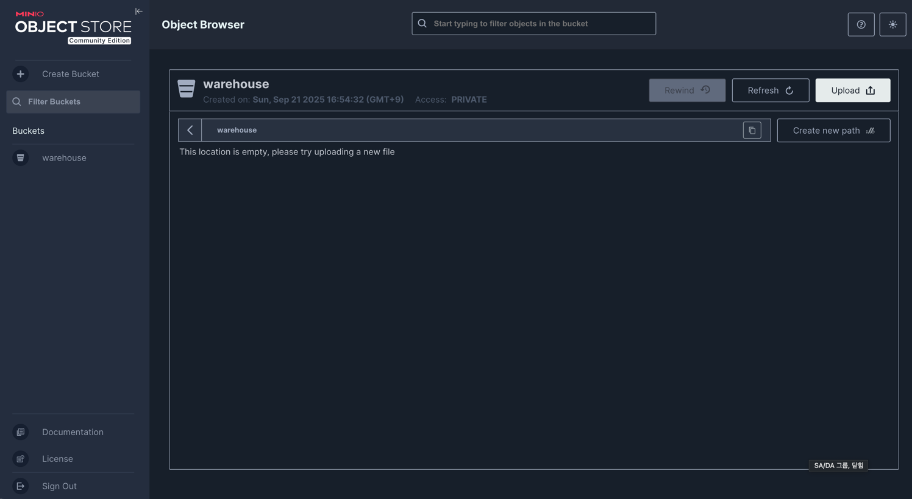

# Iceberg study

## Udemy 
* 강의 이름: Apache Iceberg: The Complete Masterclass (Hands-On)
 

## iceberg-spark-minio 환경 구성
> Spark, Iceberg, MinIo, Jupyter 를 이용한 Spark-Iceberg 실습 환경 구성

> git 저장소: https://github.com/suraj-darekar/iceberg-spark-minio.git

### Steps to Install 
* CLI Commands
```bash
docker-compose -f docker-compose.yaml up -d
```

* Verify Services
```bash

  http://localhost:8888/tree - jupyter notebook
  http://localhost:9001      - minio
```

* MinIO(http://localhost:9001/)
> ID: admin / Password: password




---
### Git Ignore(.gitignore) 사용
다음 항목들은 버전에 포함되지 않도록 최상위 `.gitignore` 에 추가되어 있습니다.

| 목적 | 패턴 |
| ---- | ---- |
| 아이스버그 저장소(테이블/메타) | `iceberg/warehouse/` |
| 주피터 노트북 체크포인트 | `iceberg/notebooks/.ipynb_checkpoints/` |
| 로컬 오버라이드 compose | `iceberg/docker-compose.override.yml` |
| IDE / 캐시 / 로그 | `.idea/`, `.vscode/`, `*.log` 등 |

수정 시 실수로 커밋된 파일을 인덱스에서 제거하려면:
```bash
git rm -r --cached iceberg/warehouse
```
새 패턴을 추가한 뒤 전체 적용을 강제하려면:
```bash
git add .
git commit -m ":wrench: chore(gitignore): 패턴 업데이트"
```

노트북 출력(대용량 셀 결과)을 줄이고 싶다면 실행 후 "Cell Output Clear" 한 뒤 커밋을 권장합니다.
