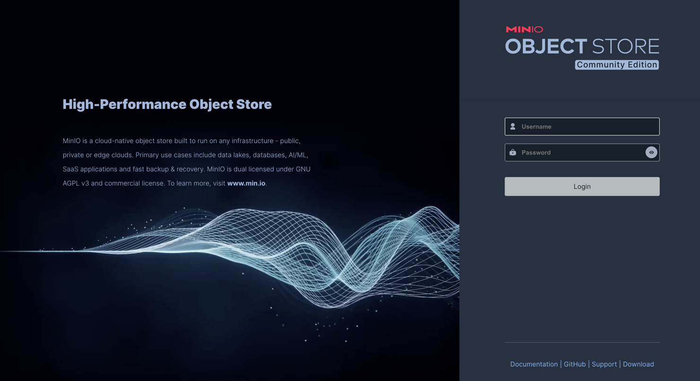
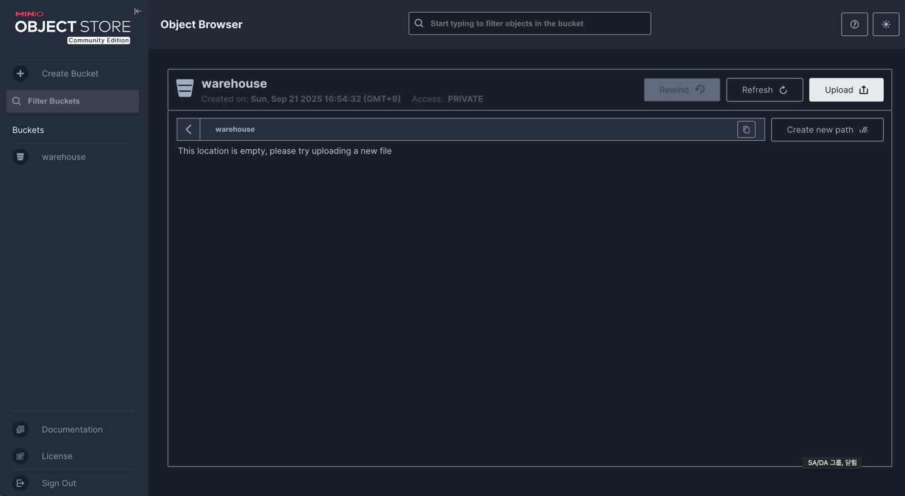
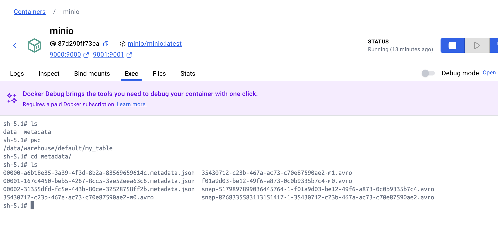

# Iceberg study

- Iceberg hands-on 학습 내용을 기록한다.
- 학습한 내용은 [`iceberg/notebooks`](./notebooks) 경로에 jupyter notebook 형태로 기록한다.

<br>

## Udemy 
* Apache Iceberg: The Complete Masterclass (Hands-On)
 
<br>

## iceberg-spark-minio 환경 구성
- 원본 git 저장소: https://github.com/suraj-darekar/iceberg-spark-minio.git


#### Run docker compose(use. [`Makefile`](./Makefile))
```bash
# 해당 make goal을 실행하여 학습에 필요한 컴포넌트를 구성할 수 있다.
$ make start.docker.compose.for.iceberg
```

#### Jupyter notebook(http://localhost:8888/)
#### Spark history server(http://localhost:18080/)
#### MinIO(http://localhost:9001/, ID: admin / Password: password)




<br>

### Iceberg files 확인하는 방법
: mino 를 s3 카탈로그 경로로 설정해두었기 때문에 mino 컨테이너의 data 경로에서 자료를 확인할 수 있다.



<br>
