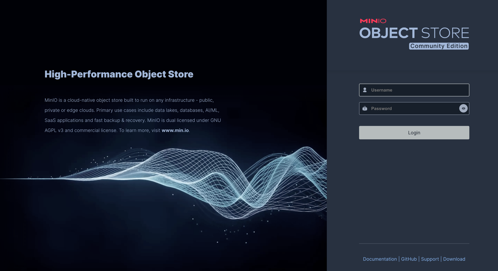
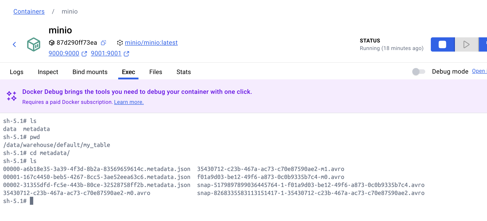

# Iceberg study

## Udemy 
* 강의 이름: Apache Iceberg: The Complete Masterclass (Hands-On)
 
<br>

## iceberg-spark-minio 환경 구성
> Spark, Iceberg, MinIo, Jupyter 를 이용한 Spark-Iceberg 실습 환경 구성

> git 저장소: https://github.com/suraj-darekar/iceberg-spark-minio.git

### Steps to Install 
* CLI Commands
```bash
docker-compose -f docker-compose.yaml up -d
```

* Verify Services
```bash

  http://localhost:8888/tree - jupyter notebook
  http://localhost:9001      - minio
```
* Jupyter notebook(http://localhost:8888/)

* MinIO(http://localhost:9001/)
> ID: admin / Password: password




### Iceberg files 확인하는 방법
: mino 를 s3 카탈로그 경로로 설정해두었기 때문에 mino 컨테이너의 data 경로에서 자료를 확인할 수 있다.

