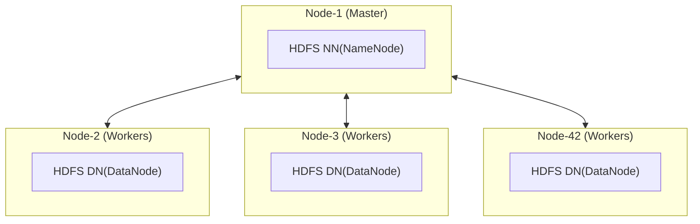

# Hadoop - HDFS
> Spark 학습 과정에서 같이 공부한 Hadoop, HDFS 내용을 기록한다.

## What is HDFS(Hadoop Distributed File System)?
* 하둡 클러스터에 데이터 파일을 저장하고 검색(Read)할 수 있도록 지원한다.

## Main Components of HDFS?
| Extentions   | Desc |
|--------------|--------------------------------|
| NM(Name Mode) | 파일 시스템의 메타데이터(파일 경로, 블록 위치)를 관리하는 중앙 서버 |
| DM(Data Node) | 실제 데이터 블록을 저장하고 클라이언트/NameNode 요청에 따라 블록을 읽고 쓰는 저장소 노드 |

## HDFS Architecture of a Hadoop Cluster

## 

client 
-> name node 에게 큰 data file 복사 명령 요청 
-> name node는 복사 명령을 하나 이상의 데이터 노드로 리다이렉션
-> 이 때, 리다이렉션 된 데이터 노드가 3개일 경우 큰 data file 은 작은 데이터 블록으로 나눠서 3개의 데이터 노드에 기록한다(이 떄, block 크기 default 값은 128MB)
-> name node는 이 프로세스를 용이하게 하고 모든 파일 메타데이터를 추적

HDFS 메타 데이터란?
- 파일 이름
- hdfs 파일 경로
- 파일 사이즈
- 파일 블록, 블록 아이디, 블록 시퀀스, 블록 위치