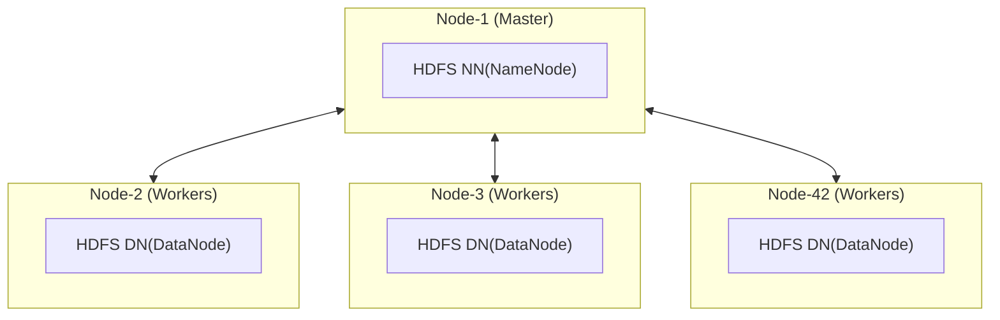
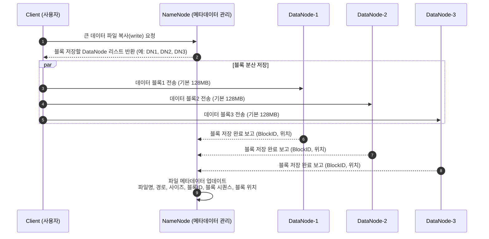
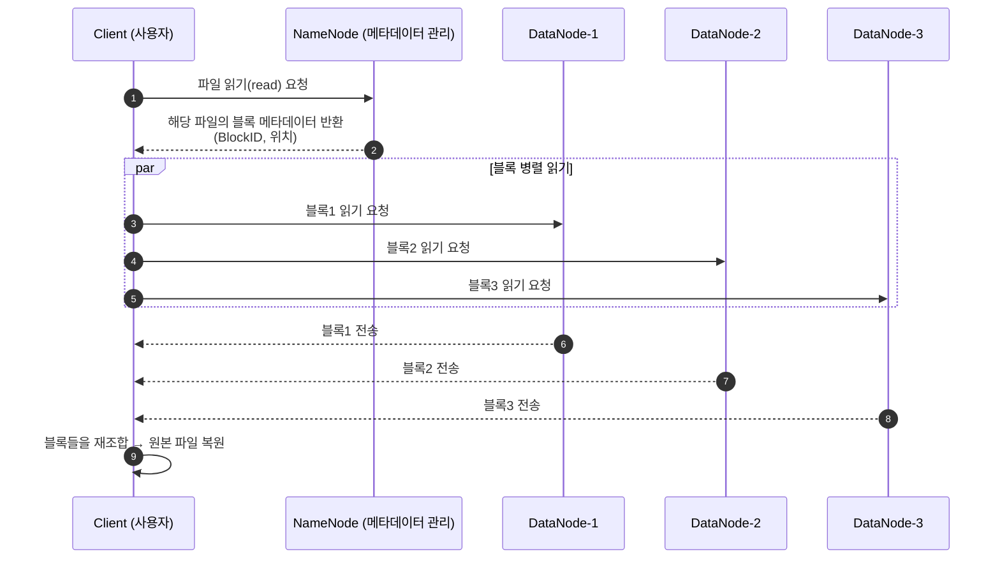

# Hadoop - HDFS
> Spark 학습 과정에서 같이 공부한 Hadoop, HDFS 내용을 기록한다.

## What is HDFS(Hadoop Distributed File System)?
* 하둡 클러스터에 데이터 파일을 저장하고 검색(Read)할 수 있도록 지원한다.

## Main Components of HDFS?
| Extentions   | Desc |
|--------------|--------------------------------|
| NM(Name Mode) | 파일 시스템의 메타데이터(파일 경로, 블록 위치)를 관리하는 중앙 서버 |
| DM(Data Node) | 실제 데이터 블록을 저장하고 클라이언트/NameNode 요청에 따라 블록을 읽고 쓰는 저장소 노드 |

## HDFS Architecture of a Hadoop Cluster

## HDFS File Write Sequence

## HDFS File Read Sequence

## What is HDFS Metadata items?

| Items | Desc |
|------|------|
| **File Name (파일 이름)** | HDFS에 저장된 파일의 이름 |
| **HDFS File Path (HDFS 파일 경로)** | 파일이 저장된 HDFS 경로 (예: `/user/hadoop/input/data.txt`) |
| **File Size (파일 크기)** | 파일 전체 크기(바이트 단위) |
| **File Blocks (파일 블록)** | 파일이 분할된 블록 단위 데이터 조각들 |
| **Block ID (블록 아이디)** | 각 블록을 식별하기 위한 고유 ID |
| **Block Sequence (블록 순서)** | 파일을 이루는 블록들의 순서 정보 |
| **Block Location (블록 위치)** | 각 블록이 저장된 DataNode의 위치 정보 |
