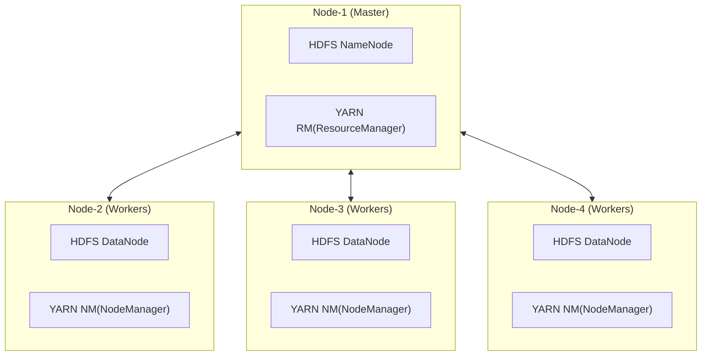
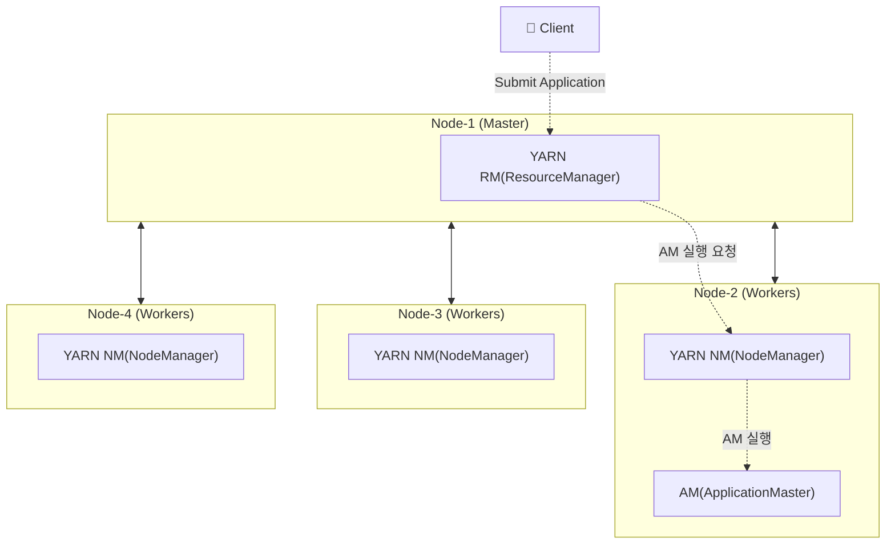
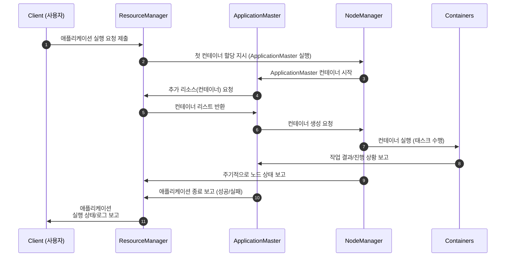

# Hadoop - YARN
> Spark 학습 과정에서 같이 공부한 Hadoop, YARN 내용을 기록한다.

## What is Hadoop?
* 하둡은 YARN, HDFS, Map/Reduce 세 가지 핵심 기능을 제공하는 분산형 데이터 처리 플랫폼이다.

## What is YARN(Yet Another Resource Manager)?
- YARN은 하둡의 리소스 관리자 매니저(클러스터 운영 체제)이다.

## What is Role of YARN?
- 여러 애플리케이션을 Hadoop 클러스터에서 실행하고 애플리케이션 간에 리소스를 공유할 수 있도록 한다.

## Main Components of YARN?
| Extentions   | Desc |
|--------------|--------------------------------|
| RM(Resource Manager) | 클러스터 전체 자원(CPU, 메모리)을 스케줄링·할당하는 중앙 관리자 |
| NM(Node Manager) | 각 노드에서 컨테이너 실행·모니터링을 담당하는 에이전트 |
| AM(Application Master) | 특정 애플리케이션의 실행을 관리하며 RM에 자원 요청하고 NM에 컨테이너 실행 지시 |

## YARN Architecture of a Hadoop Cluster

* NM은 정기적으로 RM에게 각 노드의 상태를 보고한다.

## How to Execute an Application in a Hadoop Cluster
>  클라이언트는 하둡 클러스터 RM에게 애플리케이션을 제출해야한다.

 

* Application Master 컨테이너는 제출한 애플리케이션 코드를 실행한다.
* 이 때, 컨테이너는 CPU, Memory 리소스 집합체를 의미한다.
### Application submission and execution sequence

 

* 즉, 각 애플리케이션은 서로 다른 AM 컨테이너 안에서 실행 된다.