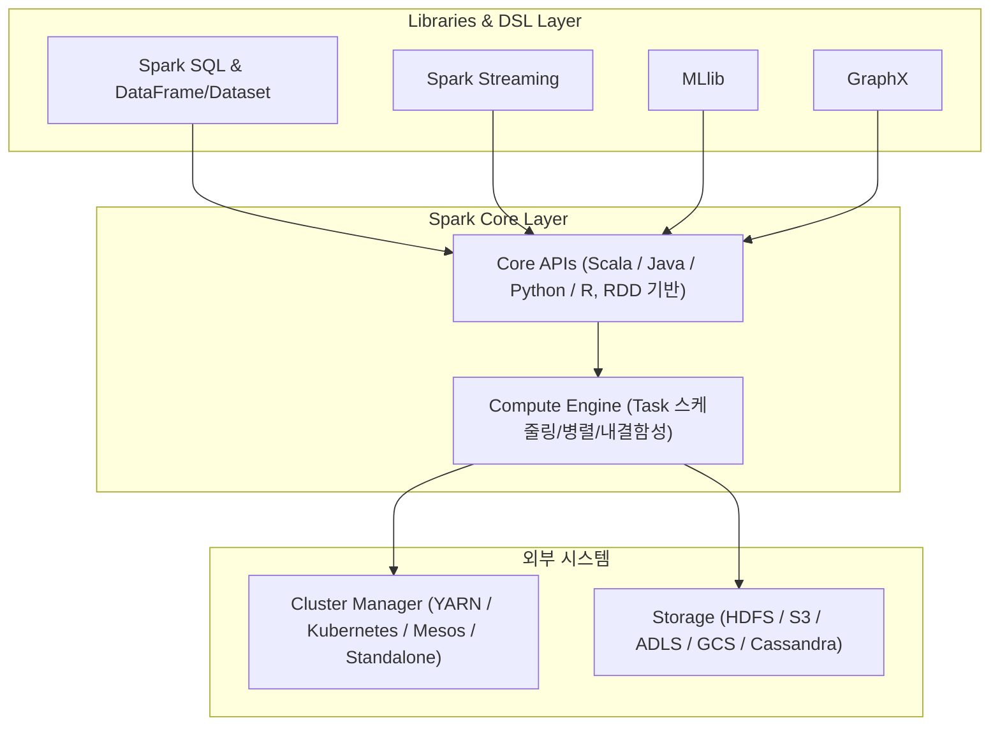

# Spark
> Spark 학습 과정에서 Spark 소개 내용을 기록한다.

## What is Apache Spark?
- 데이터 레이크 위에서 실행되는 **분산 데이터 처리 프레임워크**
- **클러스터 관리 / 스토리지 제공 X** → 외부 시스템에 의존
  - 클러스터 매니저: YARN, Kubernetes, Mesos, Standalone
  - 스토리지: HDFS, S3, ADLS, GCS, Cassandra 등
- Spark는 오직 **데이터 처리(Compute Engine)**에 집중

## Spark Workload(Architecture)

## API 계층별 특징

| 계층                          | 설명                              | 특징                           |
| --------------------------- | ------------------------------- | ---------------------------- |
| **Core APIs**               | Scala, Java, Python, R (RDD 기반) | 유연하지만 난이도↑, 최적화↓             |
| **SQL & DataFrame/Dataset** | SQL 질의 & 함수형 프로그래밍              | Catalyst/Tungsten 최적화, 실무 권장 |
| **Streaming**               | 실시간/연속 데이터 처리                   | 구조적 스트리밍 기반                  |
| **MLlib**                   | 머신러닝/딥러닝 라이브러리                  | ML 파이프라인 제공                  |
| **GraphX**                  | 그래프 처리 라이브러리                    | 알고리즘 구현 가능                   |

## Spark가 인기 있는 이유

1. **분산 환경 추상화**
   → SQL/DF/RDD로 개발자가 분산 복잡성을 몰라도 됨
2. **통합 데이터 처리**
   → 배치, 스트리밍, ML, 그래프를 하나의 엔진에서
3. **간결한 코드 & 생태계**
   → Hadoop MapReduce 대비 코드 단순, 커뮤니티 활발

## Databricks란?

* Spark 원 개발자들이 만든 회사/제품
* Spark를 클라우드 네이티브로 쉽게 사용 가능

  * AWS, Azure, GCP 지원
* **핵심 기능**

  * 클러스터 자동 생성/종료 (운영 부담 ↓)
  * 최적화 런타임 (**표준 Spark 대비 최대 5배 빠름**)
  * **Delta Lake**: ACID 트랜잭션 & 스키마 진화 지원
  * **Photon 엔진**: DWH급 SQL 성능
  * **MLflow**: 머신러닝 실험/배포/모델 관리
  * 노트북 & 협업 워크스페이스 (Git 연동 지원)

